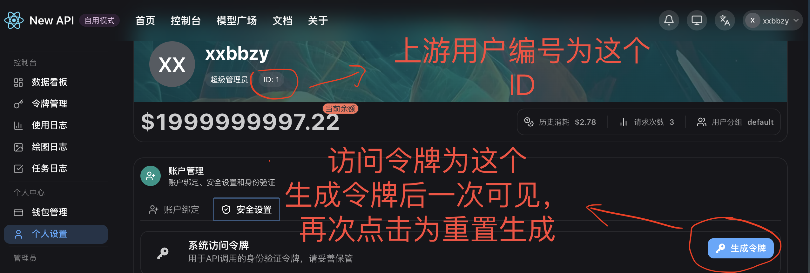

[返回文档中心](./README.md)

# 添加供应商填写示例

本文提供“添加供应商”和“在上游创建令牌”的推荐填写方式与常见错误说明。

## 示例一：添加供应商

示例输入：

- 名称：`Provider-A`
- 基础地址：`https://api.provider-a.com`
- 访问令牌：`eyJhbGciOi...`
- 上游用户编号：`88`
- 权重：`10`
- 优先级：`0`
- 启用签到：按需开启
- 启用站点代理：仅在当前环境无法直连该供应商时开启
- 代理地址：`http://proxy.example.com:7890`（可选）
- 备注：`remark`

说明：
- 上游用户编号如果一开始看到是空白，直接输入即可。
- 不需要保留默认 `0`，提交时系统会自动处理空值兼容。
- 如果已为供应商配置代理，后续编辑时代理地址留空会保持原值，不会自动清空。

## 示例二：在上游创建令牌

前置条件：
- 已完成供应商同步，能获取该渠道可用分组。

示例输入：
- 名称：`provider-a-route-token-01`
- 分组名称：从下拉框中选择（例如 `default (x1)`）
- 权重：`10`
- 优先级：`0`
- 启用：勾选
- 无限配额：按需勾选
- 模型限制：留空（不限制）或填写 `gpt-4o,gpt-4o-mini`

说明：
- 分组名称必须从下拉框选择，不能为空。
- 系统会优先默认选择上游默认分组；若不可用，则选择最低倍率分组。

## 常见错误与排查

### 错误：分组不能为空
未选择分组或分组字段被清空。请重新从下拉框选择。

### 错误：分组不属于该渠道可用分组
当前分组已过期或未同步。请先执行供应商同步，再重试创建令牌。

### 错误：上游用户编号填了用户名
该字段只接受用户数字 ID，请改为上游账号对应的数字编号。

## 相关文档

- [添加供应商字段获取指南](./provider-form-guide.md)
- [运维手册（同步与排障）](./OPERATIONS.md)
